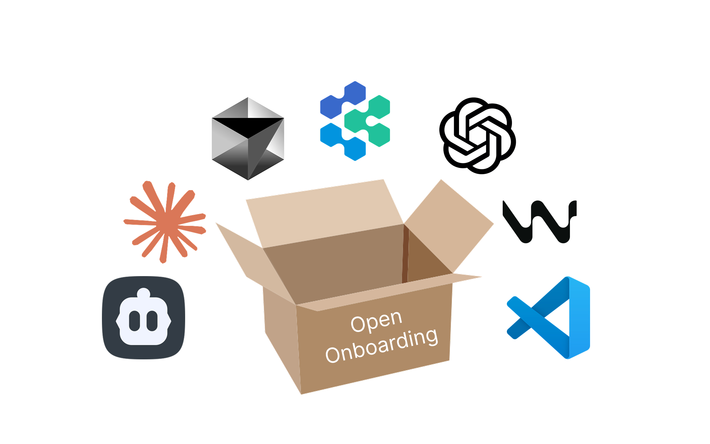

# Open Onboarding



An open-source collection of AI configuration files designed to help companies onboard new developers quickly and effectively using AI-powered development tools.

## 🎯 Purpose

This repository provides curated AI assistant configurations specifically designed for **developer onboarding**. Whether you're a new hire joining a development team, a manager onboarding new engineers, or a team lead standardizing AI tool usage, these configs help integrate new developers into your workflow faster.

### Why This Repository?

Onboarding new developers is challenging. This repository helps by:

- ✅ **Standardizing AI tool configurations** across your team
- ✅ **Accelerating learning** with AI assistance tuned for onboarding
- ✅ **Establishing consistent workflows** from day one
- ✅ **Providing mentorship-focused** AI interactions
- ✅ **Reducing time-to-productivity** for new hires

## 👥 Who Is This For?

- **New Developers** - Starting a new role and want AI assistance configured for learning
- **Engineering Managers** - Onboarding new hires and standardizing team practices
- **Team Leads** - Establishing AI-assisted development workflows
- **Mentors** - Using AI tools to support pair programming and code review
- **Companies** - Creating consistent onboarding experiences with AI tools

## 📁 Repository Structure

```
open-onboarding/
├── README.md                              # This file
├── LICENSE                                # GPL-3.0 license
├── NOTICE.md                              # Attribution and provenance
├── CONTRIBUTING.md                        # How to contribute
├── index.yml                              # Searchable config catalog
│
├── docs/                                  # Onboarding guides
│   ├── onboarding-checklist.md            # First day/week/month tasks
│   ├── quickstart-guide.md                # 15-minute setup
│   ├── ai-tools-comparison.md             # Choose the right tool
│   ├── first-week-guide.md                # Week-by-week guidance
│   └── glossary.md                        # AI development terms
│
├── claude/                                # Claude Code configs
│   ├── README.md                          # Claude onboarding guide
│   ├── CONFIGURATION_GUIDE.md             # How Claude configs work
│   ├── onboarding/                        # Onboarding-specific configs
│   │   ├── first_week_developer.md        # Week 1 config
│   │   ├── pair_programming_mentor.md     # Mentorship sessions
│   │   └── codebase_explorer.md           # Safe code exploration
│   └── general/
│       └── global_development.md          # Standard development
│
├── cursor/                                # Cursor Editor configs
│   ├── README.md                          # Cursor onboarding guide
│   └── .cursorrules/
│       ├── comprehensive_development.rules
│       └── onboarding_buddy.rules         # Pair programming focused
│
├── codex/                                 # Codex & autonomous agents
│   ├── README.md
│   └── general/
│       └── autonomous_agent_style.md      # Autonomous learning
│
├── cline/                                 # Cline (VSCode extension)
│   ├── README.md
│   └── .clinerules/
│       └── default_cline.md               # Memory bank for context
│
└── templates/                             # Customization templates
    ├── team-config-template.md            # Team-specific setup
    ├── personal-config-template.md        # Individual preferences
    └── onboarding-workflow-template.md    # Manager guide
```

## 🚀 Quick Start

### For New Developers

**Day 1 - Choose Your AI Tool:**

1. Review [docs/ai-tools-comparison.md](docs/ai-tools-comparison.md) to understand your options
2. Follow [docs/quickstart-guide.md](docs/quickstart-guide.md) for 15-minute setup
3. Start with a first-week config appropriate for your tool

**Week 1 - Learn with AI Assistance:**

```bash
# Claude Code - First week learning config
cp claude/onboarding/first_week_developer.md ~/.claude/CLAUDE.md

# Cursor - Onboarding buddy mode
cp cursor/.cursorrules/onboarding_buddy.rules myproject/.cursorrules
```

**Month 1 - Graduate to Standard Configs:**

As you become comfortable, transition to standard development configs that your team uses.

### For Engineering Managers

**Setting Up Team Onboarding:**

1. Review [templates/onboarding-workflow-template.md](templates/onboarding-workflow-template.md)
2. Customize configs for your team's specific needs
3. Create a team repository with standardized configs
4. Add to your onboarding documentation

**Example Team Setup:**

```bash
# Create team onboarding configs
mkdir -p company-onboarding/{claude,cursor,docs}

# Customize for your team
cp templates/team-config-template.md company-onboarding/claude/team-standards.md

# Add to onboarding checklist
cp docs/onboarding-checklist.md company-onboarding/docs/
```

### For Mentors & Pair Programming

**Mentorship-Focused Configs:**

```bash
# Claude - Pair programming with mentor guidance
cp claude/onboarding/pair_programming_mentor.md myproject/.claude/CLAUDE.md

# Cursor - Onboarding buddy for teaching
cp cursor/.cursorrules/onboarding_buddy.rules myproject/.cursorrules
```

## 📋 Available Configurations

See [index.yml](index.yml) for a complete searchable catalog with tags like:
- `first-week`, `onboarding`, `new-developer`
- `pair-programming`, `mentoring`, `learning`
- `team-setup`, `quick-start`, `codebase-exploration`

---

### 🤖 Claude Code Configs

**Onboarding-Specific:**

- **`first_week_developer.md`** - Simplified AI assistance for new developers
  - Learning-focused interactions
  - Detailed explanations of code and concepts
  - Safe exploration with guardrails
  - Gradual complexity increase

- **`pair_programming_mentor.md`** - AI as mentoring partner
  - Teaching-style communication
  - Encourages asking questions
  - Step-by-step explanations
  - Best practices reinforcement

- **`codebase_explorer.md`** - Safe codebase navigation for new devs
  - Read-only exploration emphasis
  - Architecture explanation focus
  - Pattern recognition guidance
  - Documentation discovery

**General Development:**

- **`global_development.md`** - Standard collaborative development
  - Peer-to-peer communication
  - Planning-first approach
  - Test-driven development

See [claude/README.md](claude/README.md) for detailed Claude Code onboarding guidance.

---

### 🖱️ Cursor Configs

**Onboarding-Specific:**

- **`onboarding_buddy.rules`** - Pair programming for new developers
  - Mentorship-style assistance
  - Learning path guidance
  - Code review training
  - Gradual independence

**General Development:**

- **`comprehensive_development.rules`** - Full development framework
  - Documentation-first approach
  - Task management
  - Quality standards
  - Testing practices

See [cursor/README.md](cursor/README.md) for Cursor onboarding guide.

---

### 🔄 Codex Configs

**Learning-Focused:**

- **`autonomous_agent_style.md`** - Autonomous learning sessions
  - Extended independent work
  - Self-directed exploration
  - Problem-solving practice
  - Comprehensive logging for review

See [codex/README.md](codex/README.md) for Codex guidance.

---

### 🧠 Cline Configs

**Context Management:**

- **`default_cline.md`** - Memory bank for session continuity
  - Maintains onboarding progress
  - Tracks learning milestones
  - Project context preservation
  - Knowledge accumulation

See [cline/README.md](cline/README.md) for Cline setup.

---

## 📖 Onboarding Documentation

### Essential Reading

1. **[docs/quickstart-guide.md](docs/quickstart-guide.md)** - Get started in 15 minutes
2. **[docs/onboarding-checklist.md](docs/onboarding-checklist.md)** - First day/week/month tasks
3. **[docs/first-week-guide.md](docs/first-week-guide.md)** - Detailed week-by-week plan
4. **[docs/ai-tools-comparison.md](docs/ai-tools-comparison.md)** - Choose the right tool
5. **[docs/glossary.md](docs/glossary.md)** - AI development terminology

### Understanding AI Tool Configuration

**New to Claude Code?** Read [claude/CONFIGURATION_GUIDE.md](claude/CONFIGURATION_GUIDE.md) to understand:
- How CLAUDE.md files work
- Output Styles and Slash Commands
- Context management
- Avoiding configuration conflicts

## 🛠️ Customization Templates

Make these configs your own:

- **[templates/team-config-template.md](templates/team-config-template.md)** - Customize for your team's workflow
- **[templates/personal-config-template.md](templates/personal-config-template.md)** - Individual developer preferences
- **[templates/onboarding-workflow-template.md](templates/onboarding-workflow-template.md)** - Manager's onboarding playbook

## 🗺️ Onboarding Journey

### Week 1: Learn the Basics
- **Focus**: Understanding codebase, tooling, and basic workflows
- **AI Config**: Use `first_week_developer.md` or `onboarding_buddy.rules`
- **Goal**: Comfortable navigating code, making small changes

### Week 2-4: Build Confidence
- **Focus**: Taking on starter tasks, code reviews, pair programming
- **AI Config**: Continue onboarding configs with mentor support
- **Goal**: First meaningful contributions, passing code review

### Month 2+: Standard Workflow
- **Focus**: Regular development velocity, team collaboration
- **AI Config**: Transition to standard team configs
- **Goal**: Full team member, self-sufficient development

## ⚠️ Important Considerations

### Context Awareness

AI configurations consume part of the AI's context window. For new developers:

- ✅ **Start with one config** - Don't combine multiple configs initially
- ✅ **Use onboarding configs first** - They're designed for learning
- ✅ **Transition gradually** - Move to advanced configs as you grow
- ✅ **Ask questions** - Configs should help, not confuse

### Safety for New Developers

Onboarding configs include guardrails:

- **Read-first approaches** - Understand before modifying
- **Explicit confirmations** - AI asks before making changes
- **Safe exploration** - Emphasis on learning, not breaking things
- **Mentor review** - Encourage code review and questions

## 🤝 Contributing

We welcome contributions! Especially:

- **Onboarding configs** for additional tools (Windsurf, Devin, etc.)
- **Team-specific patterns** that worked well for onboarding
- **Improvement suggestions** from recent hires
- **Manager playbooks** for standardized onboarding

See [CONTRIBUTING.md](CONTRIBUTING.md) for guidelines.

## ⚖️ License & Attribution

Licensed under **GNU General Public License v3.0 (GPL-3.0)**.

All configs are original works inspired by community best practices and real onboarding experiences. See [NOTICE.md](NOTICE.md) for detailed provenance.

## 🔍 Finding the Right Config

### By Experience Level

| Experience Level | Recommended Config |
|---|---|
| First week on the team | `claude/onboarding/first_week_developer.md` |
| Learning with mentor | `claude/onboarding/pair_programming_mentor.md` |
| Exploring codebase | `claude/onboarding/codebase_explorer.md` |
| Ready for standard flow | `claude/general/global_development.md` |

### By Use Case

| Use Case | Recommended Tool/Config |
|---|---|
| Interactive learning & Q&A | Claude Code - `first_week_developer.md` |
| Pair programming sessions | Cursor - `onboarding_buddy.rules` |
| Independent exploration | Codex - `autonomous_agent_style.md` |
| Maintaining context between sessions | Cline - `default_cline.md` |

### By Team Role

| Role | Recommended Resource |
|---|---|
| New developer (first week) | Start with docs/quickstart-guide.md |
| Engineering manager | Review templates/onboarding-workflow-template.md |
| Mentor/buddy | Use claude/onboarding/pair_programming_mentor.md |
| Team lead | Customize templates/team-config-template.md |

## 📚 Resources

**Onboarding Best Practices:**
- [The First 90 Days: Engineering Edition](https://lethain.com/first-ninety-days-cto-vpe/)
- [Onboarding New Engineers](https://blog.pragmaticengineer.com/onboarding-at-a-startup/)

**AI Tool Documentation:**
- [Claude Code](https://docs.anthropic.com/claude/docs/claude-code)
- [Cursor](https://cursor.sh/docs)
- [Cline VSCode Extension](https://github.com/cline/cline)

**This Repository:**
- [CONFIGURATION_GUIDE.md](claude/CONFIGURATION_GUIDE.md) - Understanding Claude mechanisms
- [NOTICE.md](NOTICE.md) - Provenance and attribution
- [CONTRIBUTING.md](CONTRIBUTING.md) - How to contribute

## 🙏 Acknowledgments

This repository builds on the excellent work of [eng-ai-agent-configs](https://github.com/yourusername/eng-ai-agent-configs) and the broader AI development community. Special thanks to:

- Engineering managers who shared onboarding workflows
- New developers who provided feedback on what works
- The r/ClaudeCode and r/Cursor communities
- [wshobson/agents](https://github.com/wshobson/agents) for inspiring configuration frameworks

See [NOTICE.md](NOTICE.md) for detailed attribution.

## 📧 Questions or Feedback?

- **New developer?** Start with [docs/quickstart-guide.md](docs/quickstart-guide.md)
- **Have suggestions?** Open an [issue](https://github.com/yourusername/open-onboarding/issues)
- **Want to contribute?** See [CONTRIBUTING.md](CONTRIBUTING.md)
- **Team setup questions?** Check [templates/](templates/)

---

**Built by the community, for onboarding** ✨

*Helping new developers become productive team members faster with AI assistance.*

*Last updated: 2025-11-03*
